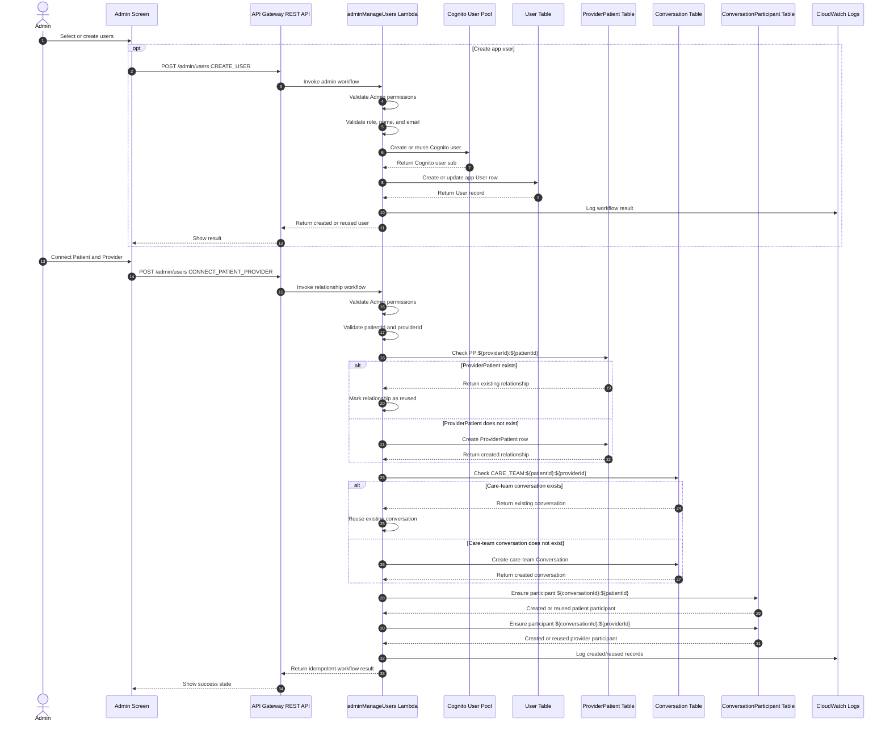

# Admin Relationship Creation Flow

This diagram shows how HealthConnect handles Admin-created Patient / Provider relationships.

The Admin workflow is intentionally backend-owned so repeated actions can safely reuse existing records instead of creating duplicate relationships or duplicate care-team conversations.



## Deterministic records created by this flow

The Admin relationship workflow creates or reuses these records:

```txt
ProviderPatient:
PP:${providerId}:${patientId}

Care-team conversation:
CARE_TEAM:${patientId}:${providerId}

Patient participant:
${conversationId}:${patientId}

Provider participant:
${conversationId}:${providerId}
```

## Idempotent behavior

The same Admin action can be run more than once without creating duplicate records.

For example, connecting the same Patient and Provider a second time should reuse:

```txt
PP:${providerId}:${patientId}
CARE_TEAM:${patientId}:${providerId}
${conversationId}:${patientId}
${conversationId}:${providerId}
```

Instead of creating another Patient / Provider relationship or another care-team conversation.

## Why this matters

This flow demonstrates several senior-level engineering decisions:

- **Relationship creation is controlled by backend workflow logic**, not scattered across frontend screens.
- **Admin actions are validated server-side** before records are created.
- **Deterministic IDs make the workflow idempotent**, so repeated actions do not corrupt the data model.
- **The care-team conversation is created from the Patient / Provider relationship**, keeping conversation structure aligned with the domain model.
- **ConversationParticipant rows are explicitly ensured**, making membership and access easier to reason about.
- **CloudWatch logging supports debugging backend workflows**, especially when validating complex multi-table writes.

## Important limitations and demo assumptions

HealthConnect is a portfolio/demo app and not a production healthcare administration system.

Current limitations and assumptions include:

- The app is not HIPAA-compliant.
- Admin users are part of the demo experience and would need stronger provisioning, audit trails, and access controls in production.
- The workflow demonstrates backend-owned consistency, but it is not a full enterprise identity-management system.
- The diagram focuses on the Patient / Provider relationship path and does not show every possible Admin screen action.
- Production systems would need additional monitoring, alerting, retries, transactional guarantees where appropriate, and security review.
- The current design is intentionally scoped for a clear employer-facing portfolio project.
