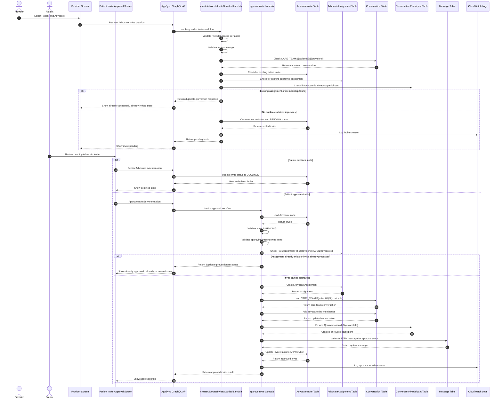

# Advocate Invite Approval Flow

This diagram shows how HealthConnect handles Advocate access through an invite and approval workflow.

The workflow separates a requested Advocate relationship from an approved Advocate assignment. This helps prevent Providers from directly granting Advocate access without Patient approval.



## Records involved in this flow

The Advocate invite approval workflow uses these records:

```txt
Care-team conversation:
CARE_TEAM:${patientId}:${providerId}

Advocate assignment:
PA:${patientId}:PR:${providerId}:ADV:${advocateId}

Advocate participant:
${conversationId}:${advocateId}
```

## Invite status lifecycle

An Advocate invite starts as:

```txt
PENDING
```

Then it can become:

```txt
APPROVED
```

or:

```txt
DECLINED
```

Only approved invites should create an `AdvocateAssignment` and add the Advocate to the care-team conversation.

## Why this matters

This flow demonstrates several senior-level engineering decisions:

- **Invite and assignment are separate concepts**, which keeps pending access requests distinct from approved access.
- **Patient approval controls Advocate access**, preventing Providers from directly granting full care-team access on their own.
- **Duplicate approval is guarded server-side**, so repeated approval attempts do not create duplicate assignments or participants.
- **Care-team membership is updated as part of the backend approval workflow**, keeping access changes centralized and consistent.
- **ConversationParticipant rows are explicitly created or reused**, making conversation access easier to reason about.
- **A system message records the approval event in the conversation timeline**, improving visibility for demo users.
- **Backend Lambdas own multi-table workflow logic**, instead of requiring the frontend to coordinate several dependent writes.

## Important limitations and demo assumptions

HealthConnect is a portfolio/demo app and not a production healthcare access-control system.

Current limitations and assumptions include:

- The project is not HIPAA-compliant.
- The workflow demonstrates production-style authorization thinking but would need deeper audit logging, compliance review, and access-control hardening for real healthcare use.
- The approval flow is intentionally scoped to Patient / Provider / Advocate relationships in the demo app.
- The diagram does not show every UI loading, error, or retry state.
- Production systems would need stronger transaction guarantees, structured audit records, monitoring, alerting, and operational runbooks.
- System messages improve conversation visibility but are not a substitute for a production audit log.
