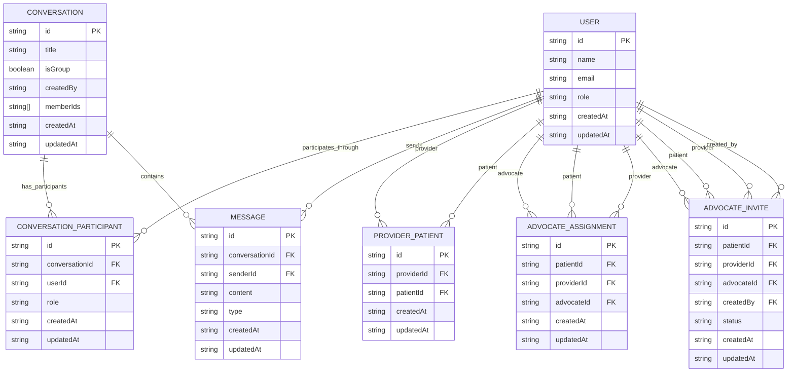

# Conversation Data Model

This diagram shows the main data relationships behind HealthConnect conversations, direct messages, care-team group chats, patient/provider relationships, advocate assignments, and advocate invites.

The model uses deterministic IDs to prevent duplicate relationships and conversations.



## Deterministic ID patterns

HealthConnect uses canonical IDs so repeated actions do not create duplicate rows.

```txt
Direct message conversation:
DM:${minUserId}:${maxUserId}

Care-team conversation:
CARE_TEAM:${patientId}:${providerId}

Provider / Patient relationship:
PP:${providerId}:${patientId}

Advocate assignment:
PA:${patientId}:PR:${providerId}:ADV:${advocateId}

Conversation participant:
${conversationId}:${userId}
```

## Conversation design

HealthConnect supports two main conversation types:

### Direct messages

Direct messages use this deterministic ID pattern:

```txt
DM:${minUserId}:${maxUserId}
```

The two user IDs are sorted before building the ID. This prevents duplicate direct-message conversations such as:

```txt
DM:userA:userB
DM:userB:userA
```

Only one direct-message conversation should exist for a unique pair of users.

### Care-team group conversations

Care-team conversations use this deterministic ID pattern:

```txt
CARE_TEAM:${patientId}:${providerId}
```

This creates one care-team conversation per Patient / Provider relationship.

When an Advocate is approved for that Patient / Provider relationship, the Advocate can be added to the existing care-team conversation rather than creating a separate duplicate group chat.

## Relationship design

### ProviderPatient

A `ProviderPatient` row represents the relationship between a Provider and Patient.

```txt
PP:${providerId}:${patientId}
```

This supports idempotent Admin workflows. If an Admin connects the same Provider and Patient more than once, the backend can reuse the existing relationship instead of creating a duplicate.

### AdvocateInvite

An `AdvocateInvite` represents a requested advocate relationship before approval.

Typical statuses:

```txt
PENDING
APPROVED
DECLINED
```

The invite allows the app to model the approval workflow separately from the final assignment.

### AdvocateAssignment

An `AdvocateAssignment` represents the approved relationship between:

- Patient
- Provider
- Advocate

```txt
PA:${patientId}:PR:${providerId}:ADV:${advocateId}
```

This makes the assignment specific to a Patient / Provider care relationship instead of treating advocacy as a global Patient / Advocate relationship.

## Why this matters

This model demonstrates several senior-level engineering decisions:

- **Deterministic IDs prevent duplicate records** without depending only on client-side checks.
- **Relationships are modeled explicitly** instead of being hidden inside loosely structured user objects.
- **Conversation membership is separated from the Conversation record** through `ConversationParticipant`, making participant-specific access easier to reason about.
- **Direct messages and care-team group chats have different identity rules**, which keeps the data model aligned with the product behavior.
- **Advocate invites and advocate assignments are separate concepts**, allowing approval state to exist before permanent access is granted.
- **Patient / Provider context is preserved for Advocate assignments**, which avoids ambiguous advocate access when a Patient has multiple Providers.

## Important limitations and demo assumptions

HealthConnect is a portfolio/demo app and not a production healthcare data system.

Current limitations and assumptions include:

- The project is not HIPAA-compliant.
- The diagram simplifies some implementation details to keep the model readable.
- DynamoDB access patterns may require additional GSIs, query optimization, and load testing for production scale.
- Production healthcare systems would need stronger audit trails, access reviews, encryption governance, retention policies, and compliance controls.
- The model is designed for a clear employer-facing demo, not for every real-world clinical relationship edge case.
