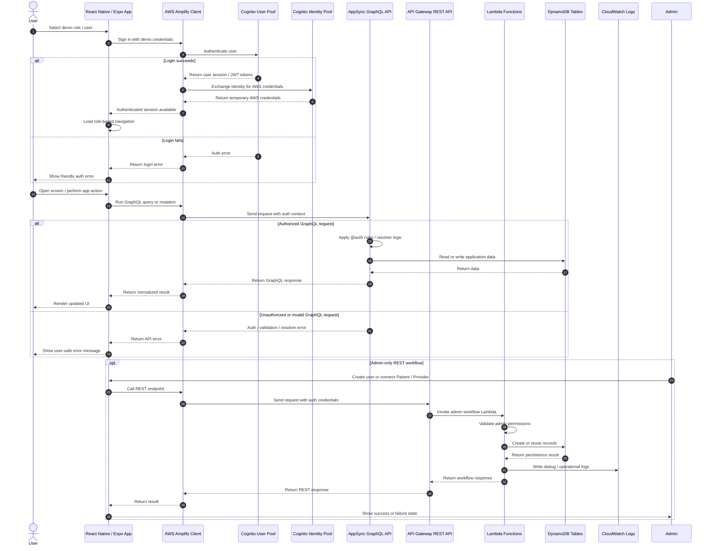

# Frontend-to-Backend Request Flow

This diagram shows how HealthConnect moves from frontend user actions to authenticated backend requests.

It covers the main request paths for login, GraphQL operations, REST admin workflows, DynamoDB persistence, and error handling.

HealthConnect uses AWS Amplify on the client to communicate with Cognito, AppSync GraphQL, and API Gateway-backed Lambda functions.

## Why this matters

This flow demonstrates several senior-level engineering decisions:

- **Authentication is centralized through Cognito** instead of custom client-side identity handling.
- **The frontend does not write directly to DynamoDB**. It goes through AppSync GraphQL or backend Lambda workflows.
- **Authorization is enforced at the API/backend layer**, not only through hidden frontend buttons.
- **Admin workflows use backend-owned logic** so relationship creation can be validated, idempotent, and consistent.
- **Errors are treated as part of the system design**, with auth, API, validation, and resolver failures flowing back to user-safe UI messages.
- **CloudWatch is included in the request path** for operational debugging of backend workflows.

## Important limitations and demo assumptions

HealthConnect is a portfolio/demo app and not a production healthcare system.

Current limitations and assumptions include:

- Demo login uses preconfigured users to make employer review easier.
- The app demonstrates role-based authorization patterns, but a real healthcare system would require deeper compliance, audit logging, least-privilege review, threat modeling, and security testing.
- Admin REST workflows are intentionally project-specific and are not a general-purpose user management platform.
- Error handling is designed for demo clarity, but production systems would need more standardized error classification, alerting, retry behavior, and incident response.
- CloudWatch is used for backend troubleshooting, but the project does not yet include a complete observability setup with alarms, metrics dashboards, distributed tracing, or structured log search.
