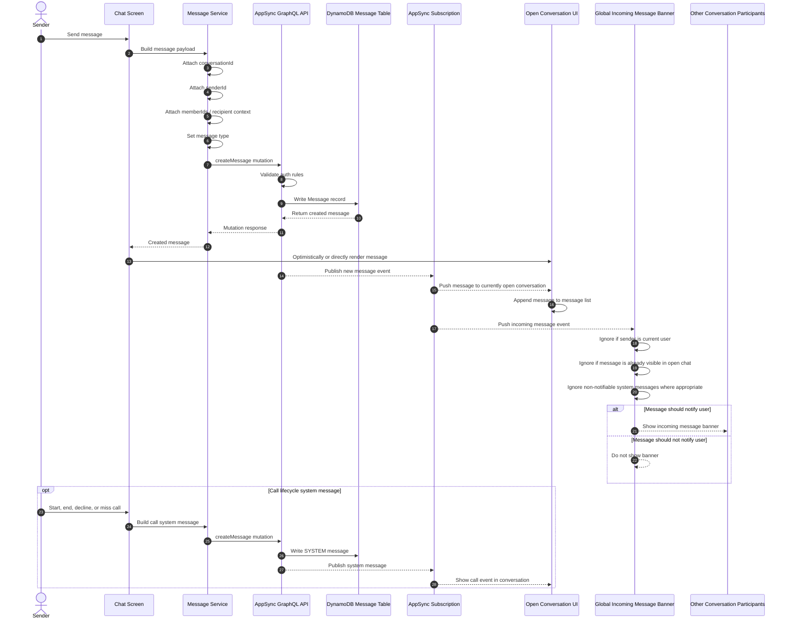

# Realtime Messaging Flow

This diagram shows how HealthConnect handles realtime messaging for direct messages, care-team group conversations, global incoming message banners, open chat updates, and call-related system messages.

HealthConnect uses AppSync GraphQL mutations to create messages and AppSync GraphQL subscriptions to push new messages to conversation participants.

## Message types in this flow

HealthConnect treats normal chat events and call lifecycle events as conversation messages.

Examples include:

- User-authored text messages
- Care-team group messages
- Direct messages
- System messages for call events
- Missed, declined, ended, or unavailable call states where relevant

This keeps the conversation timeline understandable because communication events appear in one place instead of being split across unrelated UI systems.

## Why this matters

This flow demonstrates several senior-level engineering decisions:

- **Realtime updates are backend-driven** through AppSync subscriptions rather than manual polling.
- **Messages are persisted before being broadcast**, keeping the realtime UI tied to durable backend state.
- **Conversation-level updates and global notifications are separated**, which prevents the same event from being handled the same way everywhere.
- **The global banner has filtering rules** so the user is not notified about their own messages or messages already visible in the active chat.
- **Call lifecycle events are modeled as system messages**, keeping the conversation history consistent and reviewable.
- **The frontend uses service-level message creation logic** instead of scattering message payload construction across every screen.

## Important limitations and demo assumptions

HealthConnect is a portfolio/demo app and not a production healthcare messaging system.

Current limitations and assumptions include:

- The app demonstrates realtime messaging patterns but does not claim production-grade healthcare messaging compliance.
- The project is not HIPAA-compliant.
- Message delivery, retries, offline queueing, and conflict resolution are simplified compared with a production chat system.
- Global incoming message banners are designed for demo usability and would need more robust notification handling for production.
- Push notifications are not represented in this flow.
- Call-related system messages are part of the app’s demo communication history and are not a replacement for production audit logging.
- Realtime subscription behavior depends on the authenticated user’s authorization rules and conversation membership.
