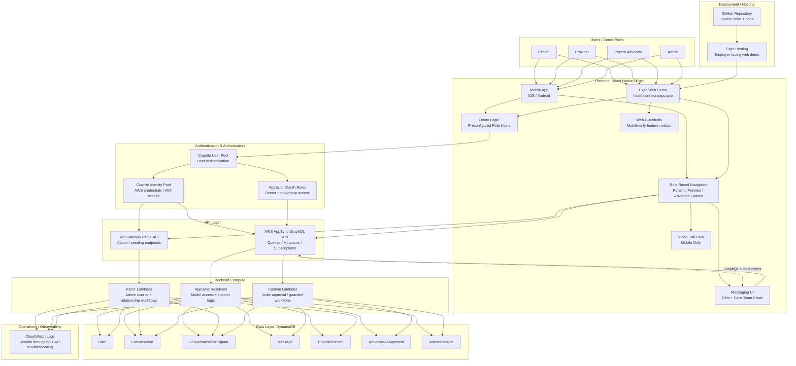

# System Overview

This diagram shows the major pieces of the HealthConnect system and how they fit together across the frontend, AWS backend, deployment layer, and operational logging.

HealthConnect is a portfolio/demo healthcare communication app built with React Native, Expo, AWS Amplify Gen 1, AppSync GraphQL, Cognito, DynamoDB, Lambda, API Gateway, and CloudWatch.

It is designed to demonstrate production-style architecture decisions, but it is **not a HIPAA-compliant production healthcare system**.

## Why this matters

This system shape demonstrates several senior-level engineering decisions:

- **Clear separation of concerns** between frontend screens, authentication, API access, backend workflow logic, and persistence.
- **Role-based product design** for Patients, Providers, Advocates, and Admins instead of a single generic user flow.
- **Managed cloud architecture** using Cognito, AppSync, DynamoDB, Lambda, API Gateway, and CloudWatch.
- **Realtime-first messaging architecture** using AppSync GraphQL subscriptions.
- **Backend-owned relationship workflows** for admin and advocate actions instead of relying only on client-side writes.
- **Portfolio-friendly deployment strategy** using Expo web hosting while still treating the app as mobile-first.

## Important limitations and demo assumptions

HealthConnect is an employer-facing portfolio project, not a production healthcare platform.

Current limitations and assumptions include:

- The app is **not HIPAA-compliant**.
- Demo login uses preconfigured users for easier reviewer access.
- Web deployment is intended for employer review, while some features remain mobile-only.
- Video calling is treated as a mobile feature and guarded on web.
- Authorization patterns demonstrate production-style thinking, but would need additional hardening, auditing, compliance review, and operational controls for real healthcare use.
- CloudWatch is used for Lambda/API troubleshooting, but the project does not yet include a full observability stack with metrics, alarms, tracing, dashboards, or incident response workflows.
